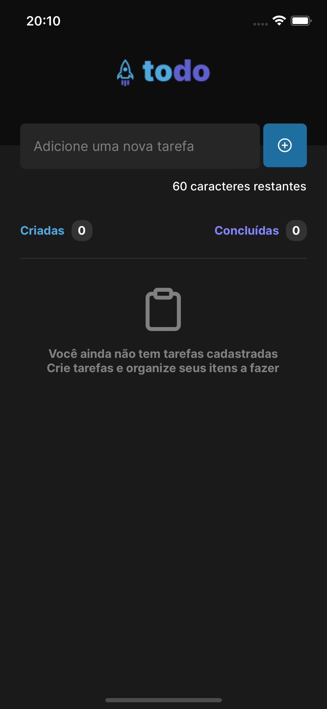
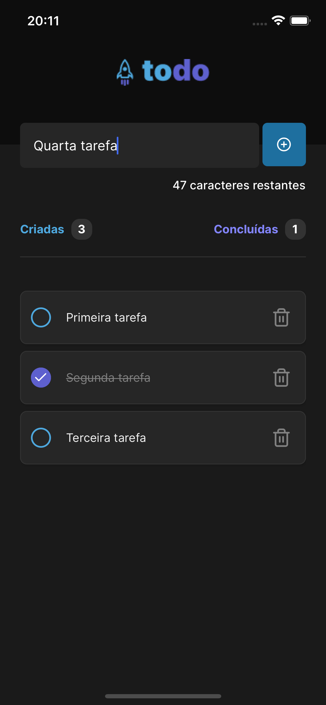
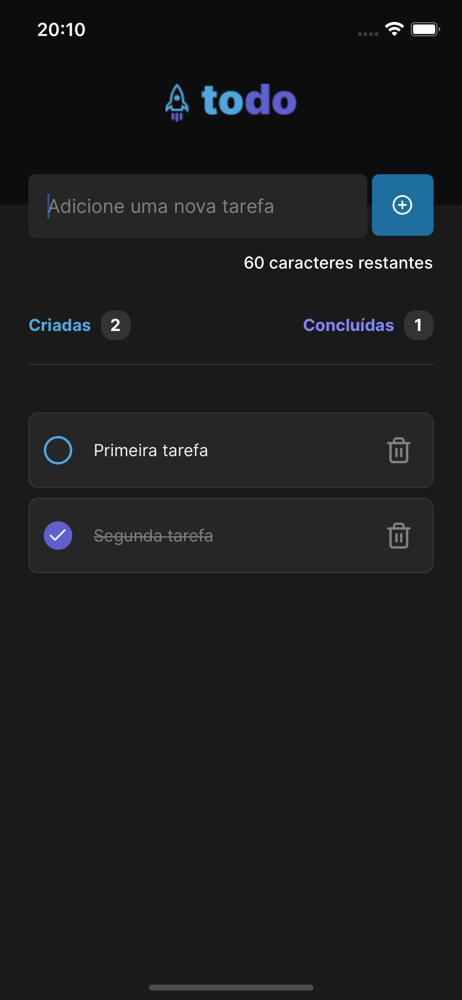
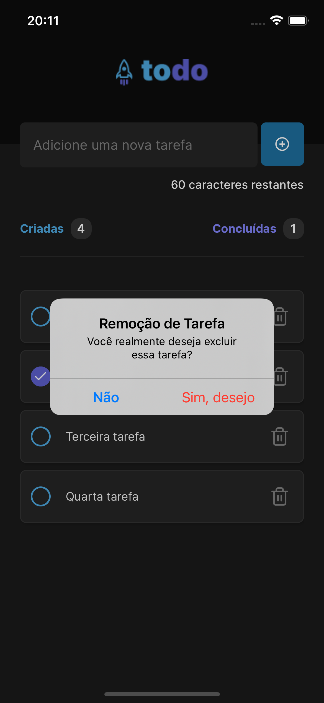

# Todo App

> Projeto com intuito de proporcionar ao usuário a capacidade de criar tarefas, listar, marcar-las como concluídas e removê-las.

### Funcionalidades

O projeto ainda está em desenvolvimento, mas já conta com algumas funcionalidades:

- [x] Criação de tarefa
- [x] Listagem das tarefas
- [x] Marcar como concluída
- [x] Remover tarefa

## 💻 Pré-requisitos

Antes de começar, verifique se você atendeu aos seguintes requisitos:

- Você possuir o Node instalado com a versão minima 16.13.2
- Você possuir o Expo instalando em sua máquina
- Você possuir o yarn instalando em sua máquina

## 💻 Tecnologias
- Expo
- React Native

## 🚀 Instalando `Todo App`

Para instalar o App, siga estas etapas:

Faça o clone do repositório

```
git clone https://github.com/thereallucas98/todo-app.git
```

Instale as dependências

```
yarn
```

Executar o Aplicativo

```
expo start
```

Por está sendo utilizando o Expo, você pode utilizar ou algum device do Android Studio ou instalar o Expo no seu dispositivo móvel e ler o QRCode

## Preview 🖼️

# Tela Home - Todos Vazios


# Tela Home - Adicionando tarefa


# Tela Home - Tarefa concluída


# Tela Home - Removendo tarefa


